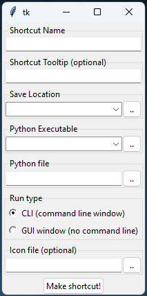

A similar project to [pyshortcut](https://github.com/newville/pyshortcuts), but I made it before I knew that one existed.

Main differences: This project has no external dependencies, and this project uses powershell commands internally to do the work instead of win API calls.

# Make Windows shortcuts to your python programs!

## Option 1: <br>
Run the makeshortcut_GUI.pyw file to make the shortcut. NOTE: It helps if you run from the same python venv or executable that you want to use to run the program in the future.



Fill in the fields.

**Shortcut Name**: the name that you want the shortcut file to have.

**Save Location**: where to put the shortcut. Choose one of the options or browse to select your own location.
* Selecting "Sendto" will add the shortcut to the rightclick "Sendto" menu when you right click on a file. The file that you right click on will be provided as an argument (`sys.argv`) so your program can use it.
* Selecting "Start Menu" will make your program searchable when you press the Win key.
* Selecting "Startup" will start your program when windows starts.

**Python Executable**: The top option is the python process you used to launch this program. This is usually the best option. For best results, launch this shortcut maker program the same way you have been launching your python program. For example if you are using VSCode with a venv to create and launch your program, also use VSCode to launch this program. That way the shortcut uses the same exact environment (for example your venv) that you have been developing with. If you installed the official python (from python.org) you will also have options of other python versions installed on your system. Or you can browse to find the python executable you want to use manually.

**Python file**: This is the entry point for your program. Eg `myscript.py` or similar.

## Option 2: <br>
Include an option inside your program to make the shortcut. For example:
```python
from makeshortcut import make_lnk

resp = input("What do you want to do? > ")
if resp == "shortcut":
    # make a desktop shortcut that runs this file in a command line window
    make_lnk(
        target = find_python(), # get the version of python currently being used
        location = get_desktop() + r"\awesomeprogram.lnk", # put the shortcut on the desktop
        arguments = __file__, # start this current file from the shortcut
        )
    print("A shortcut has been created on the desktop")
```

# This program is sus ... How do I do it manually?

First you need to find the absolute location of the python executable you want to use. An easy way to do this is to use this command inside your program:

``` python
import sys
print(sys.executable)
```

Then you need the absolute location of the python file you want to run.

Open the folder where you want to create the shortcut. If you want to use a windows special folder, put `shell:sendto`, `shell:desktop`, `shell:startup`, or `shell:programs` in your file explorer or run dialog to open the special folder.

Create a shortcut by right clicking in an empty space and selecting "New > Shortcut".

Paste in the executable location and the python file location, both enclosed in double quotes, and separated by a space, and click ok. For example:

    "C:\Users\username\AppData\Local\Programs\Python\Python313\python.exe" "C:\Users\username\OneDrive\Desktop\BespokeSoftware\cats\randomcatphoto.pyw"

To set the tooltip, icon or other attributes, right click on your new shortcut and select properties.